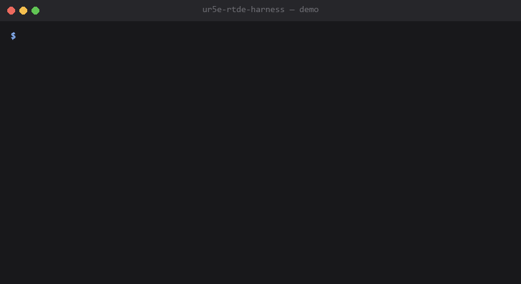

# ur5e-rtde-harness

A control and fault-characterization harness for UR5e robot arms, built against
**URSim** — Universal Robots' official simulator — using the same **RTDE**
(Real-Time Data Exchange) interface that drives real UR5e cells in production.

No physical robot required. Total hardware cost: $0.



*Terminal capture of `motion_demo.py` and `fault_harness.py` actually running,
recorded against a local mock of the `ur_rtde` interfaces (no Docker/URSim on
the recording machine) — real code path, simulated hardware layer. Against
real URSim per [`setup.md`](setup.md), the flow is identical.*

---

## Why this exists

I operate UR5e bimanual stations. When something goes wrong at the RTDE layer,
the failure isn't always graceful — I've seen a real production traceback where
a lost connection to the arm didn't raise a clean Python exception but took
down the entire process with a segmentation fault:

```
RTDEControlInterface: Could not receive data from robot...
RTDEControlInterface: Exception: available: Bad file descriptor
RuntimeError: ur_rtde: Failed to start control script, before timeout of 5 seconds
Fatal Python error: Segmentation fault
```

That's a crash in the compiled C++ layer beneath the Python bindings, not an
error the application can catch and handle. Container exit code 139 — 128 + 11,
where signal 11 is SIGSEGV — confirmed it.

You can't reproduce that on a production robot on demand. You can reproduce it
against a simulator, deliberately, as many times as you want.

This project does three things:

1. Connects to a simulated UR5e over RTDE and drives real motion
2. Logs synchronized joint telemetry the way a real data pipeline would
3. **Deliberately induces connection faults** and characterizes exactly how the
   RTDE client behaves under each — clean exception, hang, or hard crash

---

## What RTDE actually is

RTDE is UR's real-time protocol for exchanging data with the controller over
Ethernet. Unlike a request/response API, it's a **synchronized streaming
interface**: you register which fields you want, and the controller pushes them
at a fixed rate (up to 500 Hz on the UR5e), while you push commands back on the
same channel.

Three interfaces, each on its own port:

| Interface | Port | Purpose |
|---|---|---|
| `RTDEControlInterface` | 30004 | Send motion commands (`moveJ`, `moveL`, `servoJ`) |
| `RTDEReceiveInterface` | 30004 | Read joint positions, velocities, currents, safety state |
| `DashboardClient` | 29999 | Power on/off, brake release, load program, read robot mode |

The Python library `ur_rtde` wraps a C++ implementation. **That C++ layer is
where the segfault lives** — which is exactly why a fault here can kill the
process rather than raising something catchable.

---

## Quick start

```bash
# 1. Start the simulator (see setup.md for details)
docker run --rm -it -p 5900:5900 -p 6080:6080 \
  -p 29999:29999 -p 30001-30004:30001-30004 \
  universalrobots/ursim_e-series

# 2. Open the virtual teach pendant at http://localhost:6080/vnc.html
#    Power on the robot, release brakes

# 3. Install the client library
pip install ur_rtde

# 4. Verify the connection
python connect_test.py

# 5. Run a motion sequence with telemetry logging
python motion_demo.py

# 6. Induce faults and characterize the failures
python fault_harness.py --fault connection_drop --container <ursim-container>
```

Full setup, including the Docker networking gotcha that will bite you on
Windows/WSL2, is in [`setup.md`](setup.md).

---

## Repo contents

```
connect_test.py        Minimal connection verification — run this first
motion_demo.py         Joint-space motion sequence with CSV telemetry logging
telemetry_logger.py    Reusable logger — samples RTDE receive at fixed rate
fault_harness.py       Deliberate fault injection + behavior characterization
setup.md               URSim install, networking, teach pendant, WSL2 notes
rtde-notes.md          How RTDE works, the three interfaces, why segfaults happen
fault-catalog.md       Every fault: method, observed behavior, evidence
logs/                  CSV telemetry output lands here
```

---

## The faults

| # | Fault | Method | What's being tested |
|---|---|---|---|
| 1 | Connection drop mid-motion | Kill the simulator container while `moveJ` is in flight | Clean exception, hang, or crash? |
| 2 | Connect to wrong/dead host | Point at an IP with nothing listening | Does it time out cleanly? |
| 3 | Command after disconnect | Drop the connection, then issue a command on the stale handle | The "bad file descriptor" path from the real traceback |
| 4 | Control script never starts | Connect while the robot is powered off / brakes engaged | Reproduces `Failed to start control script` |
| 5 | Protocol version mismatch | Request an unsupported RTDE version | Config-layer failure vs. runtime failure |

Each is documented in [`fault-catalog.md`](fault-catalog.md) with
method, observed behavior, exit code where relevant, and whether the failure was
catchable in Python or killed the process outright.

**The question the catalog answers:** which RTDE failures can an application
defend against, and which ones can only be handled by supervising the process
from outside?

---

## Relationship to the CAN bus project

Same methodology, different layer of the stack.

| | `can-bus-fault-injector` | `ur5e-rtde-harness` |
|---|---|---|
| Layer | Physical — wiring, termination, connectors | Network + protocol — RTDE over Ethernet |
| Fault injection | Pull a wire, change a resistor | Kill a process, drop a connection |
| Evidence | `candump`, SocketCAN error counters | Python exceptions, exit codes, telemetry gaps |
| Cost | ~$50 | $0 |

Both are built to answer the same question: **when this breaks, what does it
actually look like from the diagnostic side, and is the failure recoverable
where you'd expect it to be?**
